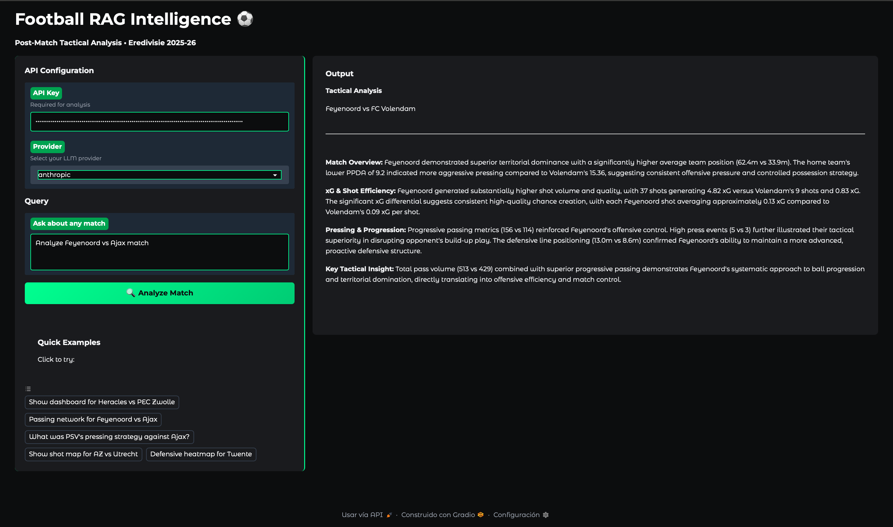
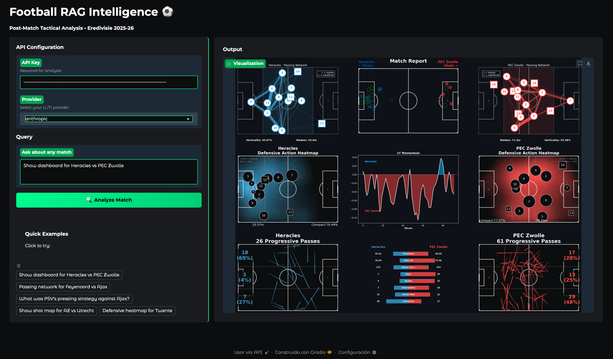

# Football RAG Intelligence

[](https://huggingface.co/spaces/rheredia8/football-rag-intelligence)

**An active sports analytics engineering project.** Natural language queries over real Eredivisie match data — grounded answers backed by a production data pipeline, not hallucinations.

🚀 **[Try the Demo](https://huggingface.co/spaces/rheredia8/football-rag-intelligence)** *(Phase 1 build — updated UI coming in Phase 3)*

> **Status:** Phase 1 complete (data pipeline + cloud infrastructure). Phase 2 in progress (RAG engine rewire + query routing).

---

## Demo

### Text Analysis


### Visualizations


---

## The Problem

Coaches, scouts, and analysts spend time bouncing between WhoScored, FotMob, and other tools to reconstruct what happened in a match. Traditional LLMs can't help because they can fabricate stats instead of retrieving them:

- ❌ "PSV dominated possession" (actual: 45%)
- ❌ "Heracles created few chances" (actual: 24 shots)
- ❌ Generic tactical commentary with no grounding

The solution presented here is a RAG system built on real match data.
---

## Architecture

```
 ┌─────────────────────────────────────────────────────────────────┐
 │  DATA COLLECTION  (local — residential IP required)             │
 │                                                                 │
 │  WhoScored ──► Playwright scraper                               │
 │  FotMob    ──► SSR extractor (__NEXT_DATA__)                    │
 │                      │                                          │
 │                 Dagster Assets                                  │
 │         (Mon/Thu schedule + manual trigger)                     │
 └────────────────────┬────────────────────────────────────────────┘
                      │
                      ▼
 ┌─────────────────────────────────────────────────────────────────┐
 │  STORAGE LAYER                                                  │
 │                                                                 │
 │  MinIO (object store)          DuckDB — lakehouse.duckdb        │
 │  └─ raw JSON                   └─ bronze_matches (412)          │
 │                                └─ match_mapping  (205)          │
 │                                └─ silver_events  (279k)         │
 │              MotherDuck (cloud DuckDB)                          │
 │              └─ same schema, auto-synced on scrape              │
 │              └─ silver_team_metrics, gold_match_summaries       │
 └────────────────────┬────────────────────────────────────────────┘
                      │
                      ▼
 ┌─────────────────────────────────────────────────────────────────┐
 │  TRANSFORMATION  (dbt Core + GitHub Actions)                    │
 │                                                                 │
 │  bronze_matches ──► silver_events      (279,104 events)         │
 │                 └─► silver_team_metrics (378 team performances) │
 │                 └─► gold_match_summaries (205 match summaries)  │
 │                                                                 │
 │  CI: GitHub Actions runs dbt --target prod on Mon/Thu 7am UTC  │
 │  Tests: PASS=69 WARN=0 ERROR=0 FAIL=0                          │
 └────────────────────┬────────────────────────────────────────────┘
                      │
                      ▼
 ┌─────────────────────────────────────────────────────────────────┐
 │  EMBEDDINGS (local DuckDB — VSS not supported in MotherDuck)    │
 │                                                                 │
 │  gold_match_summaries ──► sentence-transformers/all-mpnet-base-v2
 │                       └─► gold_match_embeddings (205 × 768-dim) │
 │                           HNSW index, array_distance() queries  │
 └────────────────────┬────────────────────────────────────────────┘
                      │
                      ▼
 ┌─────────────────────────────────────────────────────────────────┐
 │  RAG ENGINE  [Phase 2 — in progress]                            │
 │                                                                 │
 │  User query ──► router.classify_intent()                        │
 │                 │                                               │
 │         ┌───────┴────────┐                                      │
 │         ▼                ▼                                      │
 │   semantic query    viz request                                 │
 │   array_distance()  fetch df_events from DuckDB                 │
 │   → LLM (Claude)    → visualizers.py → PNG                      │
 │         │                │                                      │
 │         └───────┬────────┘                                      │
 │                 ▼                                               │
 │         {"text": ..., "chart_path": ...}                        │
 └─────────────────────────────────────────────────────────────────┘
                      │
                      ▼
 ┌─────────────────────────────────────────────────────────────────┐
 │  UI + OBSERVABILITY  [Phase 3 — planned]                        │
 │                                                                 │
 │  Streamlit / Reflex / React                                     │
 │  Opik (LLM observability) + RAGAS / DeepEval (evaluation)      │
 │  Modal (serverless GPU inference for open-source models)        │
 └─────────────────────────────────────────────────────────────────┘
```

---

## Tech Stack

| Layer | Tool | Why |
|---|---|---|
| Language | Python 3.10+ via `uv` | |
| Orchestration | Dagster (Software-Defined Assets) | Asset lineage, local scheduling |
| Object storage | MinIO | S3-compatible, runs in Docker |
| Analytics DB | DuckDB + MotherDuck | Same SQL dialect local and cloud |
| Transformation | dbt Core (`dbt-duckdb`) | SQL version control, tested models |
| Embeddings | `sentence-transformers/all-mpnet-base-v2` | 768-dim, semantic match retrieval |
| Vector search | DuckDB VSS (`array_distance`) | No external vector DB needed |
| LLM | Anthropic Claude (primary) | Multi-provider via `generate.py` |
| CI/CD | GitHub Actions | `dbt run --target prod` Mon/Thu |
| Cloud inference | Modal (planned — Phase 3) | Serverless GPU for open-source models |
| Observability | Opik (planned — Phase 3) | LLM tracing + prompt tracking |

---

## Data Coverage

- **League:** Eredivisie 2025-26
- **Matches:** 205 (100% coverage, auto-updated)
- **Events:** 279,104 tactical events (passes, shots, tackles, aerials...)
- **Metrics per match:** 24 pre-calculated tactical metrics per team (PPDA, progressive passes, xG, field tilt, compactness...)
- **Embeddings:** 205 match summary vectors, HNSW index

Sources: WhoScored (event-level) + FotMob (xG + shot data), cross-linked via `match_mapping`.

---

## Visualizations

6 tactical visualization types — rendered from raw event data, $0 LLM cost:

| Type | What it shows |
|---|---|
| **Dashboard** | Full 3×3 match report |
| **Passing Network** | Player positions + connection strength |
| **Defensive Heatmap** | KDE of defensive actions, block compactness |
| **Progressive Passes** | Forward pass zones with comet lines |
| **Shot Map** | Both teams' shots by type and xG |
| **xT Momentum** | Match flow over time (weighted Expected Threat) |

---

## LLM Providers

No vendor lock-in — swap via `provider` parameter:

| Provider | Model |
|---|---|
| Anthropic (default) | `claude-haiku-4-5` |
| OpenAI | `gpt-4o-mini` |
| Google | `gemini-1.5-flash` |
| Ollama (local) | `llama3.2:1b` |

---

## Project Structure

```
football-rag-intelligence/
├── orchestration/              # Dagster assets, schedules, sensors
│   ├── assets/                 # bronze, silver, gold, embeddings
│   └── definitions.py
├── dbt_project/                # dbt models
│   ├── models/
│   │   ├── sources.yml
│   │   ├── silver/             # silver_events, silver_team_metrics
│   │   └── gold/               # gold_match_summaries
│   └── profiles.yml            # dev (local DuckDB) + prod (MotherDuck)
├── src/football_rag/
│   ├── models/
│   │   ├── rag_pipeline.py     # RAG orchestration [Phase 2]
│   │   └── generate.py         # LLM provider abstraction
│   ├── router.py               # Intent classification
│   ├── visualizers.py          # Matplotlib plot functions
│   ├── viz_tools.py            # Viz API (dashboard/team/match)
│   ├── data/schemas.py         # Pydantic models
│   └── prompts_loader.py
├── scripts/
│   ├── materialize_embeddings.py   # Regenerate HNSW index
│   └── test_vector_search.py       # Verify VSS queries
├── tests/
├── docs/
│   ├── engineering_diary/      # Session-by-session build log
│   └── motherduck-setup.md     # Cloud DB operational reference
├── ARCHITECTURE.md
├── SCRATCHPAD.md               # Active session state
└── CLAUDE.md                   # AI assistant instructions
```

---

## Quick Start

```bash
git clone https://github.com/ricardoherediaj/football-rag-intelligence
cd football-rag-intelligence
uv sync

# Run dbt transformations (local)
cd dbt_project && uv run dbt run

# Run dbt against MotherDuck (cloud)
MOTHERDUCK_TOKEN=<token> uv run dbt run --target prod

# Start Dagster UI
uv run dagster dev

# Verify vector search
uv run python scripts/test_vector_search.py

# Run tests
uv run pytest
```

---

## Pipeline Status

| Layer | Status | Count |
|---|---|---|
| Bronze (raw JSON) | ✅ Live | 412 matches in MinIO + MotherDuck |
| Match Mapping | ✅ Live | 205/205 (100% coverage) |
| dbt Silver | ✅ Live | 279,104 events, 378 team performances |
| dbt Gold | ✅ Live | 205 summaries in MotherDuck |
| GitHub Actions CI | ✅ Live | PASS=69, runs Mon/Thu |
| Embeddings | ✅ Live | 205 × 768-dim, HNSW index |
| RAG engine (DuckDB VSS) | 🔄 Phase 2 | Rewiring from ChromaDB |
| Query router (wired) | 🔄 Phase 2 | Orchestrator layer |
| UI | 📋 Phase 3 | Streamlit / Reflex / React |
| Observability (Opik) | 📋 Phase 3 | LLM tracing + evaluation |

---

## Roadmap

**Phase 2 — RAG Engine** *(in progress)*
- Rewire `rag_pipeline.py` from ChromaDB → DuckDB VSS (`array_distance` on `gold_match_embeddings`)
- Build orchestrator: router → semantic retrieval or viz dispatch → unified response
- CLI test harness: `uv run python scripts/test_rag.py "Analyze Ajax vs PSV"`

**Phase 3 — UI + Observability** *(planned)*
- Streamlit or Reflex frontend (React long-term)
- Opik integration for LLM tracing and prompt versioning
- RAGAS or DeepEval evaluation harness
- Modal for serverless GPU inference (open-source model option)
- Updated HF Spaces demo with the new UI

---

## Engineering Log

Build decisions and session notes documented in [`docs/engineering_diary/`](docs/engineering_diary/).

---

## License

MIT
