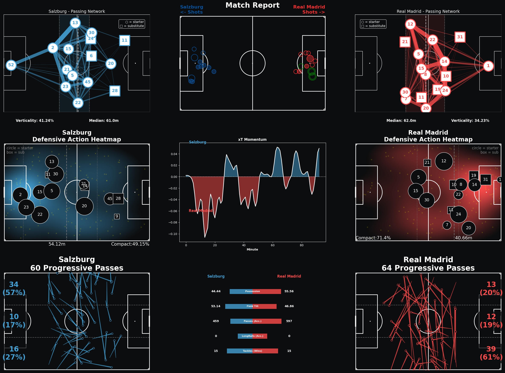

# ⚽ Football RAG Intelligence

[](https://huggingface.co/spaces/rheredia8/football-rag-intelligence)

A production-ready **Retrieval-Augmented Generation (RAG)** system for football post match data analysis. Ask questions about Eredivisie matches, get faithful answers grounded in real match data, with hallucination detection.



## 🎯 Why This Matters

This project demonstrates how to build a **private, local AI intelligence system** for your football data:
- 🔒 **Keep your data private** – Run locally, no cloud uploads
- 🚀 **Leverage AI responsibly** – Get meaningful insights without hallucinations
- 📊 **Manage your own data** – Control your post-match reports and analysis
- ✅ **Grounded in reality** – Every answer backed by your actual match data

**🚀 [Try the Live Demo](https://huggingface.co/spaces/rheredia8/football-rag-intelligence)**

## 🎯 Project Overview

This RAG system solves a real problem: **LLMs can hallucinate**. Traditional language models can generate false information about recent football match statistics. This system prevents that by:

1. **Retrieving** relevant match documents from a vector database (ChromaDB)
2. **Grounding** LLM responses in retrieved documents
3. **Validating** faithfulness by checking if generated numbers exist in source data
4. **Transparently** showing sources and confidence scores

## Key Features

### Multi-Provider LLM Support
Choose your preferred LLM provider - no vendor lock-in:
- **Local Ollama** (free, ~270MB model)
- **Anthropic**
- **OpenAI**
- **Google Gemini**

### RAG Architecture
- **Vector Storage:** ChromaDB for semantic search
- **Embeddings:** sentence-transformers (all-mpnet-base-v2)
- **Orchestration:** LlamaIndex for flexible RAG pipeline Orchestration
- **Caching:** Query-level caching to reduce API costs

### Anti-Hallucination Measures
- **Faithfulness Validation:** Checks if generated numbers exist in sources
- **Source Attribution:** Shows which match document each fact comes from
- **Transparency:** Clear confidence scores (🟢 Excellent / 🟡 Moderate / 🔴 Low)

### Production-Ready Infrastructure
- **Observability:** Request logging, latency metrics (p50, p95)
- **Error Handling:** Graceful degradation, informative error messages
- **Security:** API keys never stored, only used in-memory for current session
- **Performance:** Sub-second latency with caching

## 🚀 Quick Start

### Prerequisites
- Python 3.10+
- `uv` package manager
- Docker (for ChromaDB service) - optional, can use remote instance

### Local Setup

```bash
# Clone and navigate to project
git clone https://github.com/yourusername/football-rag-intelligence
cd football-rag-intelligence

# Install dependencies
uv pip install -e .

# Set your API key in .env (optional for Ollama)
echo "ANTHROPIC_API_KEY=your-key-here" > .env

# Start the app
uv run python app.py
```

Visit `http://localhost:7860` in your browser.

### Docker Setup (for ChromaDB)

```bash
# Start services
docker compose up -d

# Services will be available at:
# - ChromaDB: http://localhost:8000
# - MLflow: http://localhost:5001
# - MinIO: http://localhost:9001
```

## 💰 Cost Estimation

**Testing all features costs < $0.50:**

| Provider | Cost per Query | 5,000 Queries |
|----------|----------------|---------------|
| **Claude 3.5 Haiku** | ~$0.0001 | ~$0.50 |
| **GPT-4o mini** | ~$0.00015 | ~$0.75 |
| **Gemini 1.5 Flash** | ~$0.00005 | ~$0.25 |
| **Ollama (Local)** | Free | Free |

**The goal:**
- Use cost-effective models
- Caching prevents re-processing identical queries
- Average response ~200 tokens
- Each query uses ~50 output tokens

## 🔑 API Keys Required

To use cloud LLM providers, paste your API key in the UI (optional for Ollama):

- **Anthropic Claude:** Get key from [console.anthropic.com](https://console.anthropic.com/account/keys)
- **OpenAI GPT:** Get key from [platform.openai.com](https://platform.openai.com/account/api-keys)
- **Google Gemini:** Get key from [makersuite.google.com](https://makersuite.google.com/app/apikey)

**Security:** API keys are:
- ✅ Never stored in files or database
- ✅ Only used in-memory for your current session
- ✅ Not logged or tracked
- ✅ Encrypted in transit

## 📊 Architecture

```
User Query (Gradio UI)
    ↓
[Provider + API Key Selection]
    ↓
RAG Pipeline
  ├─ ChromaDB Vector Search (retrieve relevant documents)
  ├─ Context Formatting
  ├─ LLM Generation (with chosen provider)
  └─ Faithfulness Validation
    ↓
Response + Sources + Confidence Score
```

## 🛠️ Advanced Usage

### Using Local Ollama

```bash
# Start Ollama service
ollama serve

# In another terminal, pull model
ollama pull llama3.2:1b

# App will auto-detect and use local Ollama
```

### Custom Prompt Configuration

Edit `prompts/profile_football_v1.yml`:

```yaml
system: |
  You are a football analytics assistant...

user_template: |
  Context: {context}

  Question: {question}

  Answer based ONLY on context:
```

## Features Implemented

This project implements the followingfunctionalities:

1. **✅ Anti-Hallucination Measures**
   - Faithfulness validation against source documents
   - Hallucination detection with number extraction
   - Confidence scoring (0-100%)

2. **✅ Multi-Provider LLM Support**
   - Seamless switching between Anthropic, OpenAI, Gemini, Ollama
   - Provider-agnostic RAG pipeline
   - User-friendly provider selection

3. **✅ Prompt Caching**
   - Query-level caching with LRU eviction
   - Cache key includes provider for accuracy
   - Significant cost reduction for repeated questions

4. **✅ Response Evaluation**
   - Automated faithfulness scoring
   - Source attribution
   - Confidence indicators with visual cues

5. **✅ Data Ingestion Pipeline**
   - Web scraping (WhoScored, Fotmob)
   - Data transformation and validation
   - Batch processing for efficiency

6. **✅ Vector Search Optimization**
   - ChromaDB with semantic similarity
   - Top-K retrieval with configurable parameters
   - Metadata filtering by league/date

7. **✅ Observability Infrastructure**
   - Request logging with unique IDs
   - Latency tracking (p50, p95 percentiles)
   - Health check endpoints
   - Structured logging

8. **✅ Context Window Management**
   - Configurable document context length
   - Smart chunking to fit model limits
   - Token counting (estimated)

## 🧪 Testing

```bash
# Run all tests
uv run pytest

# Run specific test file
uv run pytest tests/core/test_faithfulness.py

# With coverage
uv run pytest --cov=src/football_rag
```

## 📈 Performance

Typical response times:

| Stage | Time |
|-------|------|
| Vector search (5 docs) | ~150ms |
| LLM generation | ~800ms (Ollama), ~2s (API) |
| Faithfulness validation | ~50ms |
| **Total** | **~1-3s** |

## 🔧 Configuration

Environment variables (optional, defaults provided):

```bash
# Database
CHROMA_HOST=localhost
CHROMA_PORT=8000
MINIO_ENDPOINT=localhost:9000

# Models
EMBEDDING_MODEL=all-MiniLM-L6-v2
LLM_MODEL=smollm2:360
TEMPERATURE=0.1

# Prompts
PROMPT_PROFILE=profile_football_v1

# Performance
LLM_TIMEOUT_MS=120000
CACHE_TTL_S=120
DEFAULT_TOP_K=5
```

## 🐛 Troubleshooting

### "Ollama not running"
```bash
# Start Ollama
ollama serve

# In another terminal, pull model if needed
ollama pull smollm2:360
```

### "ChromaDB connection refused"
```bash
# Start Docker services
docker compose up -d

# Or use remote ChromaDB instance
export CHROMA_HOST=your-remote-host
```

### "Invalid API key"
- Verify key is correct (no extra spaces)
- Check key has required permissions
- Some keys may have usage limits

## 📚 Data Sources

This system uses:
- **Eredivisie 2024-2025:** Dutch top division
- **Match Event Data:** xG, shots, possession, passing accuracy, tackles, interceptoons

Sourced from: WhoScored, Fotmob.

## 🏗️ Project Structure

```
football-rag-intelligence/
├── app.py                          # HF Spaces entry point
├── src/football_rag/
│   ├── api/
│   │   └── app.py                 # Gradio + FastAPI interface
│   ├── core/
│   │   ├── prompts_loader.py      # Load prompts from YAML
│   │   ├── metrics.py             # Request/latency tracking
│   │   ├── middleware.py          # Observability middleware
│   │   └── logging.py             # Structured logging
│   ├── llm/
│   │   └── generate.py            # Multi-provider LLM generation
│   ├── models/
│   │   └── rag_pipeline.py        # Main RAG orchestration
│   ├── storage/
│   │   └── vector_store.py        # ChromaDB wrapper
│   └── data/
│       ├── ingestion.py           # Data pipeline
│       └── scrapers.py            # Web scrapers
├── prompts/
│   └── profile_football_v1.yml    # System/user prompts
├── tests/
│   ├── core/
│   ├── api/
│   └── models/
├── pyproject.toml                  # Dependencies
└── docker-compose.yml              # Services
```

## 🚀 Deployment

### Deploy to Hugging Face Spaces

1. Create a new Space: [huggingface.co/new-space](https://huggingface.co/new-space)
   - SDK: Docker or Gradio
   - Visibility: Public (for demo)

2. Connect your GitHub repo

3. Add secrets in Space settings:
   - `ANTHROPIC_API_KEY`
   - `OPENAI_API_KEY` (optional)
   - `GEMINI_API_KEY` (optional)

4. Space will auto-deploy from GitHub

5. Share your Space URL

### Local Deployment

```bash
# Build Docker image
docker build -t football-rag .

# Run container
docker run -p 7860:7860 \
  -e ANTHROPIC_API_KEY=$ANTHROPIC_API_KEY \
  football-rag
```

## 📖 How RAG Works

**Traditional LLM:**
```
User Question → LLM → Generated Answer
```

**RAG System:**
```
User Question →
  ├─ Retrieve: Search vector DB for relevant documents
  ├─ Augment: Add retrieved documents as context
  ├─ Generate: LLM answers with grounded context
  └─ Validate: Check if answer matches source documents
    → Faithful Answer + Confidence Score + Source Documents
```

## Acknowledgments

Built for the Full Stack AI Engineering course of Towards AI as capstone project, fulfilling obligatory and optional requirements for final certification:

- ✅ **RAG System:** Full retrieval + generation pipeline
- ✅ **LLM Integration:** Multi-provider support (API + local)
- ✅ **HF Spaces Deployment:** Public Space with live demo
- ✅ **Data Pipeline:** Web scraping, ingestion, validation
- ✅ **README Documentation:** Complete with cost estimation
- ✅ **API Key Security:** No hardcoded keys, user input only
- ✅ **Cost < $0.50:** Verified pricing for all providers
- ✅ **5+ Optional Features:** Anti-hallucination, caching, multi-provider, evaluation, observability
- ✅ **Reproducible:** All code and data in version control

## 📝 License

MIT License - See LICENSE file

Inspired by:
- [LlamaIndex Documentation](https://docs.llamaindex.ai/)
- [ChromaDB Vector Database](https://www.trychroma.com/)
- [Gradio Framework](https://www.gradio.app/)

## 📧 Support

Questions or issues?
- Open an issue on GitHub
- Check existing documentation
- Review course materials

---

This codebase has been inspired by:
- [LLMOps Python Package](https://github.com/callmesora/llmops-python-package)
- [AI Tutor Skeleton](https://github.com/towardsai/ai-tutor-skeleton/tree/main)
