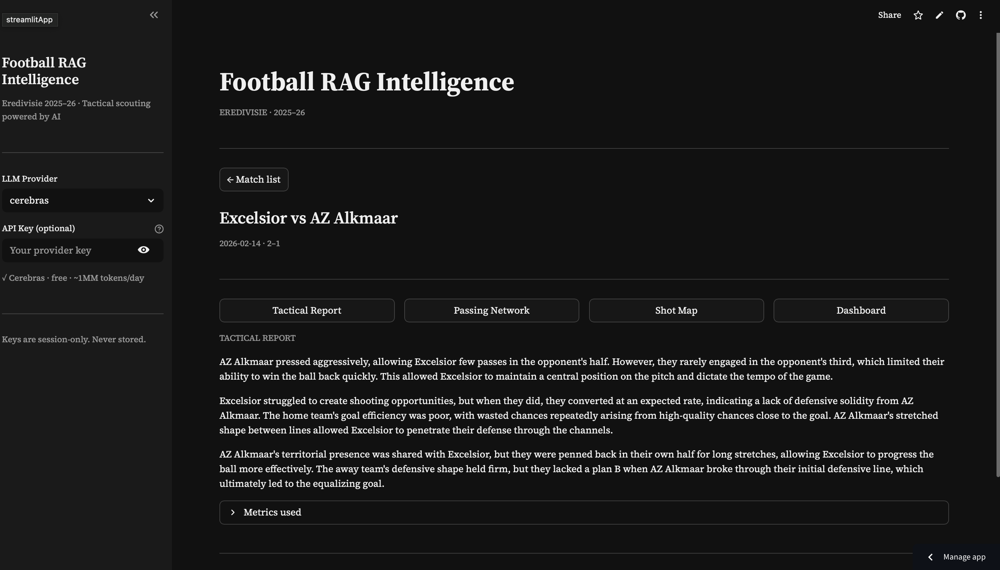
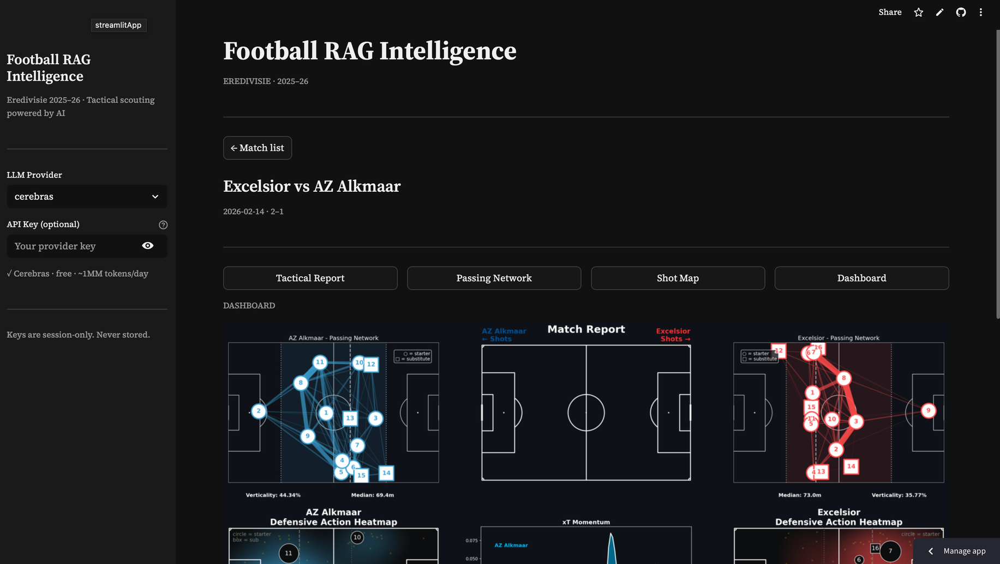

# Football RAG Intelligence

[](https://football-rag-intelligence-wcib5jk9shbywatdgaeeya.streamlit.app)
[](https://huggingface.co/spaces/rheredia8/football-rag-intelligence)

**A self-hosted data platform that turns match event data into natural language.** Browse Eredivisie 2025–26 teams and matches, and get AI-powered tactical reports grounded in real event data — built for analysts and scouts who need fast, reliable post-match insights without the tab-switching.

🚀 **[Try the Live Demo](https://football-rag-intelligence-wcib5jk9shbywatdgaeeya.streamlit.app)**

---

## The Problem

After a match, coaches, scouts, and analysts bounce between WhoScored, FotMob, and spreadsheets to reconstruct what happened. Generic LLMs don't help — they fabricate statistics instead of retrieving them:

- ❌ "PSV dominated possession" (actual: 45%)
- ❌ "Heracles created few chances" (actual: 24 shots)
- ❌ Tactical commentary with no grounding in real data

**This project fixes that.** A production RAG pipeline retrieves actual match metrics — xG, PPDA, progressive passes, field tilt, compactness — from a live data warehouse and feeds them to an LLM that writes from the numbers, not around them. The result: scout-style reports in seconds, grounded in real event data, with full traceability from query to source.

---

## Demo

### Tactical Report — Excelsior vs AZ Alkmaar


### Dashboard — Excelsior vs AZ Alkmaar


---

> **Status:** 🟢 **Phase 1–4a COMPLETE + v1.5 UI on Streamlit Cloud**
> - Phase 1: Data pipeline (412 matches, 279k events, dbt + MotherDuck + CI)
> - Phase 2: RAG engine (DuckDB VSS retrieval, Opik tracing, multi-path routing)
> - Phase 3a: Evaluation locked (retrieval_accuracy=1.0, tactical_insight=0.91, answer_relevance=0.84)
> - Phase 3b: **Streamlit UI v1.5** — three-panel browsable UI (Team → Match → Report), deployed on Streamlit Cloud
> - Phase 4a: **Hybrid pipeline automation** — scrape → dbt → embed → HF deploy, fully chained via Dagster sensors. dagster-daemon auto-starts at macOS login via launchd.

---

## Results

| Metric | Value | Meaning |
|--------|-------|---------|
| **Retrieval Accuracy** | 1.0000 (10/10) | Every query returns the correct match (Recall@1) |
| **Tactical Insight** | 0.9142 | Domain judge validates grounding + specificity + terminology |
| **Answer Relevance** | 0.8380 | LLM output remains on-topic to user query |
| **Pipeline Coverage** | 205/205 (100%) | All Eredivisie 2025-26 matches in schema |
| **Latency** (local) | ~1.5s | Query embed + VSS + LLM response |
| **Data Freshness** | Mon/Thu 7am UTC | GitHub Actions dbt run (CI integrated) |
| **Tests** | 57 passing, 0 failing | End-to-end pipeline + RAG + observability |

**Baseline:** 10 tactical analysis test cases evaluated via opik.evaluate(), all metrics locked in production.

---

## Architecture

```
 ┌─────────────────────────────────────────────────────────────────┐
 │  DATA COLLECTION  (local — residential IP required)             │
 │                                                                 │
 │  WhoScored ──► Playwright scraper                               │
 │  FotMob    ──► SSR extractor (__NEXT_DATA__)                    │
 │                      │                                          │
 │                 Dagster Assets                                  │
 │         (Mon/Thu schedule + manual trigger)                     │
 └────────────────────┬────────────────────────────────────────────┘
                      │
                      ▼
 ┌─────────────────────────────────────────────────────────────────┐
 │  STORAGE LAYER                                                  │
 │                                                                 │
 │  MinIO (object store)          DuckDB — lakehouse.duckdb        │
 │  └─ raw JSON                   └─ bronze_matches (412)          │
 │                                └─ match_mapping  (205)          │
 │                                └─ silver_events  (279k)         │
 │              MotherDuck (cloud DuckDB)                          │
 │              └─ same schema, auto-synced on scrape              │
 │              └─ silver_team_metrics, gold_match_summaries       │
 └────────────────────┬────────────────────────────────────────────┘
                      │
                      ▼
 ┌─────────────────────────────────────────────────────────────────┐
 │  TRANSFORMATION  (dbt Core + GitHub Actions)                    │
 │                                                                 │
 │  bronze_matches ──► silver_events      (279,104 events)         │
 │                 └─► silver_team_metrics (378 team performances) │
 │                 └─► gold_match_summaries (205 match summaries)  │
 │                                                                 │
 │  CI: GitHub Actions runs dbt --target prod on Mon/Thu 7am UTC  │
 │  Tests: PASS=69 WARN=0 ERROR=0 FAIL=0                          │
 └────────────────────┬────────────────────────────────────────────┘
                      │
                      ▼
 ┌─────────────────────────────────────────────────────────────────┐
 │  EMBEDDINGS (local DuckDB — VSS not supported in MotherDuck)    │
 │                                                                 │
 │  gold_match_summaries ──► sentence-transformers/all-mpnet-base-v2
 │                       └─► gold_match_embeddings (205 × 768-dim) │
 │                           HNSW index, array_distance() queries  │
 └────────────────────┬────────────────────────────────────────────┘
                      │
                      ▼
 ┌─────────────────────────────────────────────────────────────────┐
 │  RAG ENGINE  [Phase 2 — COMPLETE ✅]                            │
 │                                                                 │
 │  User query ──► orchestrator.query() (router)                   │
 │                 │                                               │
 │         ┌───────┴────────┐                                      │
 │         ▼                ▼                                      │
 │   semantic query    viz request                                 │
 │   DuckDB VSS        fetch df_events from DuckDB                 │
 │   (array_distance)  visualizers.py → PNG                        │
 │   @opik.track       @opik.track                                 │
 │   → LLM (Cerebras)  → generate_with_llm()                       │
 │         │                │                                      │
 │         └───────┬────────┘                                      │
 │                 ▼                                               │
 │         {"commentary": ..., "metrics_used": ...}               │
 └─────────────────────────────────────────────────────────────────┘
                      │
                      ▼
 ┌─────────────────────────────────────────────────────────────────┐
 │  OBSERVABILITY  [Phase 3a — COMPLETE ✅]                        │
 │                                                                 │
 │  Opik (@opik.track on orchestrator + rag_pipeline + generate)   │
 │  EDD (3 metrics: retrieval_accuracy=1.0, tactical_insight=0.91, │
 │       answer_relevance=0.84) via opik.evaluate()                │
 │  21 pytest tests gated by --run-edd flag                        │
 │  Baseline: 10 test cases, all passing, metrics locked in Opik  │
 └─────────────────────────────────────────────────────────────────┘
                      │
                      ▼
 ┌─────────────────────────────────────────────────────────────────┐
 │  UI  [Phase 3b — COMPLETE ✅]                                   │
 │                                                                 │
 │  Streamlit Cloud — three-panel browsable UI                     │
 │  Team Grid → Match List → Match Report                          │
 │  Panel 1+2: MotherDuck (team stats, match lists)                │
 │  Panel 3: RAG pipeline (lakehouse.duckdb + Cerebras LLM)        │
 │  4 report types: Tactical · Passing Network · Shot Map · Dash   │
 └─────────────────────────────────────────────────────────────────┘
```

---

## Tech Stack

| Layer | Tool | Notes |
|---|---|---|
| Language | Python 3.12 via `uv` | |
| Orchestration | Dagster (Software-Defined Assets) | Asset lineage, sensor-chained jobs, daemon as macOS LaunchAgent |
| Object storage | MinIO | S3-compatible, single Docker container (Bronze JSON only) |
| Analytics DB | DuckDB + MotherDuck | Same SQL dialect local and cloud |
| Transformation | dbt Core (`dbt-duckdb`) | SQL version control, tested models |
| Embeddings | `sentence-transformers/all-mpnet-base-v2` | 768-dim, semantic match retrieval |
| Vector search | DuckDB VSS (`array_distance`) | No external vector DB needed |
| LLM (default) | Cerebras — `llama3.1-8b` | 1MM free tokens/day, ~1s inference |
| LLM (fallback) | Anthropic Claude | BYOK via sidebar |
| Frontend | Streamlit Cloud | Auto-deploys on `git push main` |
| CI/CD | GitHub Actions | `dbt run --target prod` Mon/Thu |
| Observability | Opik | `@opik.track` end-to-end, EDD harness with 3 metrics |
| Evaluation | `opik.evaluate()` + custom scorers | retrieval_accuracy (1.0), tactical_insight (0.91), answer_relevance (0.84) |

---

## LLM Providers

No vendor lock-in — swap via `provider` parameter or sidebar:

| Provider | Model | Notes |
|---|---|---|
| **Cerebras** (default) | `llama3.1-8b` | Free, 1MM tokens/day, no key needed |
| Anthropic | `claude-sonnet-4-6` | BYOK |
| OpenAI | `gpt-4o-mini` | BYOK |
| Google | `gemini-1.5-flash` | BYOK |

---

## Data Coverage

- **League:** Eredivisie 2025-26
- **Matches:** 205 (100% coverage, auto-updated)
- **Events:** 279,104 tactical events (passes, shots, tackles, aerials...)
- **Metrics per match:** 24 pre-calculated tactical metrics per team (PPDA, progressive passes, xG, field tilt, compactness...)
- **Embeddings:** 205 match summary vectors, HNSW index

Sources: WhoScored (event-level) + FotMob (xG + shot data), cross-linked via `match_mapping`.

---

## Visualizations

6 tactical visualization types — rendered from raw event data, $0 LLM cost:

| Type | What it shows |
|---|---|
| **Dashboard** | Full 3×3 match report |
| **Passing Network** | Player positions + connection strength |
| **Defensive Heatmap** | KDE of defensive actions, block compactness |
| **Progressive Passes** | Forward pass zones with comet lines |
| **Shot Map** | Both teams' shots by type and xG |
| **xT Momentum** | Match flow over time (weighted Expected Threat) |

---

## Why This Stack

- **DuckDB VSS instead of a vector DB:** No Pinecone, Weaviate, or Milvus. `array_distance()` on FLOAT[768]. Embedding updates are SQL transactions, not API calls. The same file that stores events also stores vectors.
- **dbt for transformations:** SQL version-controlled, testable, re-runnable. Bronze/Silver/Gold medallion scales to any league — parameterized by league from day one.
- **Opik observability as infrastructure:** LLM calls traced from orchestrator → rag_pipeline → generate. 3 domain-specific scorers with CoT reasoning. Metrics locked, not vibes — baseline committed, thresholds in code.
- **Cerebras as default LLM:** 1MM free tokens/day, ~1s inference. No key required to use the app. Claude as fallback for longer context or BYOK users.
- **Dagster sensor chain:** End-to-end pipeline automation without a managed workflow service. Runs on a laptop, survives sleep, auto-starts at login.

---

## Project Structure

```
football-rag-intelligence/
├── orchestration/              # Dagster assets, schedules, sensors
│   ├── assets/                 # bronze, silver, gold, embeddings, metrics
│   └── definitions.py
├── dbt_project/                # dbt models
│   ├── models/
│   │   ├── sources.yml
│   │   ├── silver/             # silver_events
│   │   └── gold/               # gold_match_summaries
│   └── profiles.yml            # dev (local DuckDB) + prod (MotherDuck)
├── src/football_rag/
│   ├── app/
│   │   ├── main.py             # Streamlit UI — three-panel drill-down
│   │   └── styles.py           # CSS injection — dark editorial theme
│   ├── models/
│   │   ├── rag_pipeline.py     # RAG orchestration (VSS + metrics fetch)
│   │   └── generate.py         # LLM provider abstraction
│   ├── analytics/
│   │   └── metrics.py          # classify_metrics() — tactical labels
│   ├── router.py               # Intent classification
│   ├── visualizers.py          # Matplotlib plot functions
│   ├── viz_tools.py            # Viz API (dashboard/team/match)
│   ├── data/schemas.py         # Pydantic models
│   └── prompts_loader.py
├── data/
│   └── raw/xT_grid.csv         # Static Expected Threat grid (1KB)
├── scripts/
│   ├── materialize_embeddings.py   # Regenerate HNSW index
│   └── test_vector_search.py       # Verify VSS queries
├── tests/
├── docs/assets/                # README screenshots
├── .streamlit/config.toml      # Dark theme — read by Streamlit Cloud
├── ARCHITECTURE.md
├── SCRATCHPAD.md               # Active session state
└── CLAUDE.md                   # AI assistant instructions
```

---

## Quick Start

```bash
git clone https://github.com/ricardoherediaj/football-rag-intelligence
cd football-rag-intelligence
uv sync

# Run dbt transformations (local)
cd dbt_project && uv run dbt run

# Run dbt against MotherDuck (cloud)
MOTHERDUCK_TOKEN=<token> uv run dbt run --target prod

# Start Dagster UI
uv run dagster dev

# Verify vector search
uv run python scripts/test_vector_search.py

# Run tests
uv run pytest
```

---

## Pipeline Status

| Layer | Status | Details |
|---|---|---|
| **Data Collection** | ✅ Live | WhoScored + FotMob scrapers, 412 raw matches in MinIO |
| **Match Mapping** | ✅ Live | 205/205 (100% coverage) cross-linked via fotmob_id |
| **dbt Silver** | ✅ Live | 279,104 events, 378 team performances, GitHub Actions CI=PASS |
| **dbt Gold** | ✅ Live | 205 match summaries in MotherDuck (24 metrics per match) |
| **Embeddings (Phase 1)** | ✅ Live | 205 × 768-dim sentences, HNSW index in DuckDB |
| **RAG Engine (Phase 2)** | ✅ DONE | DuckDB VSS retrieval, multi-path routing (semantic + viz), @opik.track |
| **EDD Eval (Phase 3a)** | ✅ DONE | 3 scorers (retrieval=1.0, tactical_insight=0.91, answer_relevance=0.84), 21 pytest tests locked |
| **Streamlit UI (Phase 3b)** | ✅ DONE | v1.5 three-panel browsable UI (Team → Match → Report), Cerebras default, deployed on Streamlit Cloud |
| **Pipeline Automation (Phase 4a)** | ✅ DONE | scrape → dbt → embed → HF deploy chained via Dagster sensors. dagster-daemon as macOS LaunchAgent (auto-starts at login). Mon/Thu 7am UTC schedule. |
| **Extended Inference (Phase 4b)** | 📋 Planned | Additional open-source model providers, EDD evaluation in CI |

---

## Roadmap

**Phase 1 — Data Pipeline** ✅ COMPLETE
- Bronze/Silver/Gold medallion (dbt + Dagster)
- 205 matches with 24 tactical metrics each
- Auto-sync to MotherDuck, CI/CD on Mon/Thu

**Phase 2 — RAG Engine** ✅ COMPLETE
- DuckDB VSS retrieval (no external vector DB)
- Intent router: semantic text → LLM, viz requests → charts
- `orchestrator.query()` as single entry point
- Multi-provider LLM support (Cerebras/Claude/OpenAI/Gemini)

**Phase 3a — Observability** ✅ COMPLETE
- `@opik.track` end-to-end (orchestrator → rag_pipeline → generate)
- EDD harness: 3 scorers, 21 pytest tests, 10 golden eval cases
- Metrics locked in Opik (baseline: retrieval=1.0, tactical_insight=0.91, answer_relevance=0.84)

**Phase 3b — Streamlit UI + Deploy** ✅ COMPLETE
- v1.5 three-panel drill-down: Team Grid → Match List → Match Report
- Dark editorial theme (Playfair Display headers, green accent, square buttons)
- Cerebras default (free, 1MM tokens/day), BYOK for any provider
- Shot maps, passing networks, dashboards + tactical text — all live at public URL
- Deployed on Streamlit Cloud (auto-deploys on `git push main`)
- Cold start: downloads 536MB lakehouse.duckdb from private HF Dataset

**Phase 4a — Hybrid Pipeline Automation** ✅ COMPLETE
- Dagster sensor chain: `scrape_and_load_job` → `transform_job` → `deploy_job` (fully automatic)
- `deploy_job`: uploads lakehouse.duckdb (536MB) to HF Dataset
- `dagster-daemon` as macOS LaunchAgent — auto-starts at login, survives laptop sleep
- SQLite-backed local Dagster home (no Docker dependency for orchestration)
- Mon/Thu 7am UTC schedule via `eredivisie_post_matchday`

**Phase 4b — Extended Inference** *(planned)*
- Additional open-source model providers
- EDD evaluation in CI (GitHub Actions)
- Prompt versioning tied to eval scores

---

## Engineering Log

Build decisions and session notes documented in [`docs/engineering_diary/`](docs/engineering_diary/).

---

## License

MIT
